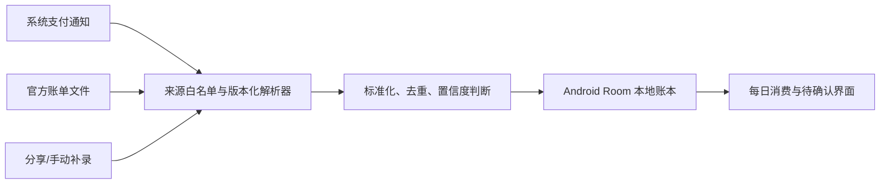

# Android 每日消费记录设计方案（待审核）

## 1. 范围与原则

- 只开发 Android；Web 和 iOS 不新增页面、入口、权限或运行逻辑。
- 本阶段只做方案，不实现代码。
- 第一版推荐数据仅保存在 Android 设备本地，不上传服务端。
- 不使用无障碍服务读取其他 App 界面，不破解或调用微信、支付宝等未公开个人账单接口。
- 不申请 `READ_SMS`。Google Play 对短信权限有严格的默认短信应用限制；银行短信只能在其内容正常显示为系统通知时，通过用户主动授权的通知使用权识别。
- 自动记录必须可解释、可撤销。低置信度内容进入“待确认”，不静默写入正式账本。

## 2. 可行性结论

Android 没有公开 API 可以直接读取所有第三方 App 的个人交易数据库。可用的数据来源如下：

| 来源 | 自动程度 | 覆盖范围 | 限制 |
| --- | --- | --- | --- |
| `NotificationListenerService` | 自动 | 微信、支付宝、银行、购物/外卖 App 发出的系统通知 | App 不发通知、通知内容隐藏或处于前台只显示内部结果时无法捕获 |
| 账单文件导入 | 半自动 | 微信/支付宝/银行允许用户导出的账单 | 需要用户定期导出并选择文件；格式会变化 |
| Android 分享入口 | 半自动 | 用户从订单/账单页分享的文字、文件或截图 | 依赖来源 App 是否支持分享 |
| 手动补录 | 手动 | 所有遗漏交易 | 需要用户操作 |

因此，“所有交易都有记录”应定义为：支持来源尽量自动捕获，并通过账单导入的差异核对发现遗漏，最后允许快速补录。仅靠后台监听无法承诺 100% 自动覆盖。

## 3. 推荐架构

### Android 原生层

- 使用官方 `NotificationListenerService` 接收用户授权后的通知。
- 只处理明确支持的包名；其他通知立即丢弃，不保存标题或正文。
- 从官方 `Notification.EXTRA_TITLE`、`EXTRA_TEXT`、`EXTRA_BIG_TEXT`、`EXTRA_TEXT_LINES` 中读取可见文本。
- 每个来源使用独立、可版本化的 Kotlin 解析器，不使用一个宽泛正则匹配所有通知。
- 使用 Jetpack Room 保存结构化交易；这是 Android 官方推荐的本地结构化数据方案。
- 密钥放入 Android Keystore；商户、账户尾号、外部流水号等敏感字段使用 AES-GCM 字段级加密。
- 通过现有 React Native 原生模块模式向界面提供查询、确认、编辑、删除、导入和统计接口。

### React Native Android 界面

- Android 侧边栏新增“每日消费”，iOS/Web 不渲染入口。
- 顶部显示当天支出、退款、净支出和待确认数量。
- 交易列表显示时间、商户、来源、金额、支付方式尾号和识别状态。
- “待确认”页允许一键确认、修改、合并重复项或标记为非交易。
- 提供通知使用权状态、支持来源、最近一次捕获时间和账单导入入口。

## 4. 数据模型

`ExpenseTransaction` 建议字段：

- `id`
- `occurredAt`：交易发生时间，不使用通知入库时间代替
- `amountMinor`：以分为单位的整数，避免浮点误差
- `currency`：第一版固定 `CNY`，模型保留扩展
- `direction`：`expense`、`refund`、`income`、`transfer`
- `merchant`
- `provider`：微信、支付宝、银行、淘宝、美团等
- `paymentMethodMasked`：仅保存脱敏尾号/名称
- `sourceType`：`notification`、`statement_import`、`share`、`manual`
- `sourcePackage`
- `externalTransactionId`：若来源提供则加密保存
- `confidence`：高、中、低
- `reviewState`：已确认、待确认、已忽略
- `parserVersion`
- `dedupeKey`
- `createdAt`、`updatedAt`

默认不保存完整原始通知正文。开发诊断若确有需要，必须由用户单独开启，脱敏、加密并在 7 天内自动删除。

## 5. 识别与防重复

### 识别规则

- 必须同时匹配“交易成功语义”和合法金额，广告、优惠券、订单待支付、余额提醒不能记账。
- 淘宝/美团的“订单已提交”不算交易；只认支付成功或账单结算信息。
- 退款作为独立负向流水，不直接修改原消费，便于审计。
- 中等置信度（缺少商户、支付状态或时间）进入待确认。
- 解析器按来源 App 和通知模板版本维护，并使用脱敏真实样本做回归测试。

### 去重策略

1. 优先使用来源流水号。
2. 没有流水号时，使用来源、方向、金额、商户、账户尾号和交易时间窗口生成哈希。
3. 支付 App、购物 App、银行 App 同时通知同一笔交易时，合并为一个交易并保留多个来源引用。
4. 账单导入以官方流水号和发生时间为主，自动匹配既有通知记录，只补缺失项。

## 6. 权限与隐私流程

1. 用户进入“每日消费”后先看用途说明和实际限制。
2. 用户主动点击后打开 Android 通知使用权设置。
3. 返回应用后展示已授权状态和当前支持来源；拒绝授权仍可使用导入与手动补录。
4. 所有数据默认只在本机；设置中提供完整导出、清空和关闭监听。
5. 若未来增加云同步，必须单独设计端到端加密、隐私政策、数据保留和删除流程，不能默认复用现有普通 API。

## 7. 分阶段开发

### 阶段 A：采样验证（不发布）

- 确认用户实际使用的微信、支付宝、美团、淘宝和银行 App 包名/版本。
- 收集每类来源的脱敏通知样本：消费、退款、失败、广告、重复通知。
- 形成解析器测试夹具，验证哪些场景根本不产生系统通知。

### 阶段 B：本地账本 MVP

- NotificationListenerService、授权状态和 Android 原生桥接。
- Room 数据库、加密字段、去重引擎。
- 微信、支付宝及用户实际使用银行的高置信度解析器。
- 每日列表、总额、待确认、编辑/删除、手动补录。

### 阶段 C：完整性核对

- 使用 Android Storage Access Framework 选择官方导出的 CSV/XLSX/ZIP 账单。
- 针对来源实现导入器和差异报告。
- 增加 Android 分享入口，接收账单文字/文件；截图 OCR 只有在文字/文件不可用时再评估。

### 阶段 D：扩展与稳定

- 增加美团、淘宝和更多银行模板。
- 增加分类规则、月度汇总、导出与备份。
- 适配通知模板变更，并在解析失败率上升时提示用户导入账单核对。

## 8. 验收标准

- 未授权通知使用权时不读取任何其他 App 通知。
- 非白名单通知正文不落盘。
- 支持模板的成功支付、退款和失败通知均有自动化测试。
- 同一交易由多个 App 通知时只生成一条正式记录。
- 服务进程重启、应用未打开和手机重启后仍能继续监听。
- 用户关闭权限后立即停止采集。
- 每日金额使用整数分计算，跨午夜、时区变化和退款不会统计错误。
- Android 入口和权限只存在于 Android；Web/iOS 构建与界面不变。

## 9. 开发前需要确认

1. 第一版是否接受“本地保存，不上传服务器”（推荐）。
2. 转账、红包、信用卡还款是否计入“消费”；推荐单独记为 `transfer`，不计入日常消费总额。
3. 请列出需要首批支持的银行 App，以及是否还使用云闪付、京东、美团月付、花呗等渠道。
4. 是否接受“通知自动记录 + 官方账单导入核对”的覆盖定义；如果要求完全自动且 100% 覆盖，Android 公开能力无法实现。

## 10. 权威依据

- Android `NotificationListenerService`  
  https://developer.android.com/reference/android/service/notification/NotificationListenerService
- Android Notification extras  
  https://developer.android.com/reference/android/app/Notification
- Android 通知使用权设置入口  
  https://developer.android.com/reference/android/provider/Settings#ACTION_NOTIFICATION_LISTENER_SETTINGS
- Android Jetpack Room  
  https://developer.android.com/training/data-storage/room
- Android Keystore 与加密建议  
  https://developer.android.com/privacy-and-security/keystore  
  https://developer.android.com/privacy-and-security/cryptography
- Android/Google Play 短信与敏感权限限制  
  https://developer.android.com/guide/topics/permissions/default-handlers  
  https://support.google.com/googleplay/android-developer/answer/16558241
- Google Play AccessibilityService 政策  
  https://support.google.com/googleplay/android-developer/answer/10964491
