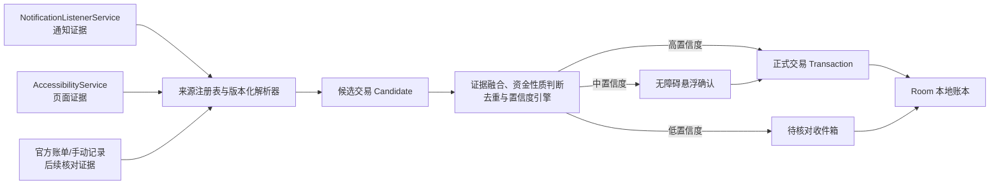

# Android 每日收支记录设计方案（审核稿）

> 状态：阶段 0/1 基础开发中，自动解析器尚未启用
> 目标设备：三星手机，Android 16
> 发布方式：私有 APK/侧载，不考虑 Google Play 上架
> 平台边界：只修改 Android；Web 与 iOS 不增加入口、权限、页面或逻辑

## 0. 开发状态（2026-07-05）

已开始阶段 0/1 的基础开发：

- 已建立 Android 专属“每日收支”入口、明细、待核对、数据源健康和手动记账页面。
- 已建立通知使用权、无障碍服务、后台电池状态检查和系统设置入口。
- 已建立 AndroidX Room 账本、Keystore AES-GCM 字段加密、审计记录和备份排除规则。
- 已建立来源 App 选择、包名/版本/签名记录、模板版本变化熔断和七天加密诊断采样。
- 已建立通知监听、只读无障碍页面快照、交易候选门控、无障碍确认悬浮层及通知回退。
- 已建立资金性质、支出/收入分类、待核对和自动记录硬门槛的数据结构。
- TypeScript 类型检查和 ESLint 已通过。

尚未启用任何微信、支付宝、银行或购物 App 的自动解析器。解析器注册表保持为空是有意的安全门槛：必须先在目标三星 Android 16 真机采集用户主动授权的脱敏样本，按 App 签名、版本和模板完成回归验证，达到第 15 节门槛后才能自动记录。

原生 Gradle 编译仍待本机 Android SDK 许可证由用户明确接受后验证；不能由开发代理代替用户接受该法律协议。

## 1. 结论

采用“通知栏读取 + 无障碍读取交易结果页 + 无障碍悬浮窗确认 + 后续账单核对”的组合方案。

这套方案在固定的三星 Android 16 设备、固定常用 App 版本上可做到较高实时性和较高准确率，但不能承诺自动覆盖 100% 的手机交易，原因是：

- Android 没有公开 API 可以读取微信、支付宝、银行等第三方 App 的完整个人账单。
- 来源 App 可能不发系统通知，或者只显示“有新消息”而隐藏金额。
- Android 16 允许支付 App 把金融页面标记为无障碍敏感数据；非真正辅助工具的服务将无法读取这些节点。
- 部分 App 使用自绘、游戏画布、特殊 WebView 或安全页面，无障碍树中可能没有可解析文本。
- App 更新后页面和通知模板会变化，未经重新验证不能继续高置信度自动记账。
- 工作资料、三星安全文件夹、应用分身可能处于不同用户/资料空间，不能假设主用户中的监听服务能够观察到。

因此系统目标定义为：

1. 已验证模板产生的高置信度交易自动记录。
2. 信息不足或有冲突的交易才弹出确认。
3. 无法实时识别的交易进入待核对，不伪造确定结果。
4. 后续使用官方账单导入做完整性核对。

### 1.1 准确性和实时性目标

以下是开发验收目标，不是未经实测的现状承诺：

| 指标 | 目标 |
| --- | --- |
| 高置信度自动记录精确率 | `>= 99%` |
| 经用户确认后的记录精确率 | `>= 99.9%` |
| 已验证 App/版本/场景的召回率 | `>= 90%` |
| 通知回调后的处理延迟 | P95 `< 500ms`，不包含来源 App 自己延迟发通知的时间 |
| 页面进入稳定状态到提示/入账 | P95 `< 1.5s` |
| 严重重复记账 | 上线测试集必须为 0 |

不能给“所有 App 总体召回率 100%”的承诺。某个支付页如果被 Android 16 的敏感数据保护完全隐藏，该页面的无障碍识别召回率就是 0，只能依靠通知、银行侧证据或账单导入。

## 2. 读取边界与隐私定义

用户的目标是只记录支出和收入。只读取金额本身无法判断“成功/失败、支出/收入、退款/转账、是否重复、属于什么分类”，因此识别时必须在内存中同时读取最少量的交易上下文：

- 金额与币种；
- 成功、失败、退款等最终状态；
- 支出、收入、转账等资金方向；
- 发生时间；
- 商户/交易对手的必要标识；
- 支付方式或账户尾号；
- 订单号/流水号的必要部分。

约束如下：

- 只允许用户主动启用的 App 进入包名白名单。
- 白名单外的通知和页面事件立即丢弃。
- 白名单内也只在已验证的交易页面/通知模板中提取字段。
- 聊天内容、联系人、商品详情、搜索内容、地址、验证码、密码、键盘输入等不写入日志或数据库。
- 不保存整页无障碍树，不保存完整原始通知。
- 第一版不做页面截图、不做 OCR、不申请 `READ_SMS`。
- 银行短信只有在三星短信 App 把正文显示为系统通知时，才把该通知作为候选证据。
- 第一版所有账本数据仅保存在本机，不上传服务器。

Android 的授权本身是“可访问通知”和“可访问屏幕内容”的广泛授权，系统没有“只授权金额”这一粒度。上述最小化只能由本应用的白名单、解析器、存储和审计机制保证，授权页必须向用户如实说明。

## 3. 数据源分层

### 3.1 A 类：资金事实来源

这些来源用于判断钱是否实际发生变化：

- 微信支付；
- 支付宝；
- 中国银行、广发银行及其他银行 App；
- 银行交易短信的系统通知；
- 后续支持的云闪付等支付工具。

A 类证据优先用于确定金额、方向、最终状态、支付账户和流水号。只有经验证的 A 类模板才允许单源高置信度自动记录。

### 3.2 B 类：订单与分类来源

这些来源主要提供订单、商户和消费类别信息：

- 美团；
- 京东；
- 淘宝；
- 抖音；
- 拼多多；
- 小红书；
- 后续新增的其他购物、外卖、出行和本地生活 App。

B 类的“订单已提交、已下单、待支付”不能作为资金已经变化的证据。“支付成功”可以生成候选，但优先等待微信、支付宝或银行的 A 类证据关联。同一订单只能形成一笔交易。

### 3.3 C 类：核对来源

- 微信、支付宝、银行等官方导出的账单文件；
- 用户主动分享的账单文字或文件；
- 手动补录。

C 类用于发现实时监听的漏记、修正分类和核对余额。第一版实时捕获完成后再开发，不与首批监听同时扩张范围。

## 4. 总体架构

### 4.1 实时链路不能依赖定时任务

- 通知到达后直接在 `NotificationListenerService` 回调中提取候选。
- 页面变化直接由 `AccessibilityService` 事件触发。
- `WorkManager` 只负责延迟清理、每日完整性检查、导入处理等可延期任务，不用于实时监听。
- 无障碍页面变化需 `300-800ms` 防抖，并在稳定后读取两次摘要；两次一致才进入解析，避免动画中间态或金额尚未刷新时误记。

## 5. Android 16 与三星专项设计

### 5.1 无障碍服务

服务仅做只读识别和显示确认悬浮层：

- `android:canRetrieveWindowContent="true"`；
- 只订阅必要事件，例如窗口状态变化、窗口内容变化；
- 运行时按用户启用的包名过滤；
- 不执行点击、滑动、自动支付、返回、填写表单等动作；
- 不截屏；
- 不读取键盘和密码节点；
- `isAccessibilityTool` 必须如实声明为 `false`，不能为了读取 Android 16 敏感节点而冒充辅助工具。

Android 16 的 `accessibilityDataSensitive` 保护会让某些支付页节点不可见。发现根节点为空、关键节点被隐藏或页面指纹无法匹配时，立即降级到通知证据或待核对，不能尝试绕过系统保护。

### 5.2 悬浮确认

优先使用无障碍服务提供的 `TYPE_ACCESSIBILITY_OVERLAY`，不再单独申请普通 `SYSTEM_ALERT_WINDOW`：

- 高置信度：显示约 4 秒的非阻塞提示“已记录 ¥xx · 分类 · 撤销”，默认不要求确认。
- 中置信度：显示“确认 / 修改 / 忽略”，可修改资金性质、分类和商户。
- 低置信度：不遮挡支付页面，只发本应用通知并进入“待核对”。
- 支付 App 阻止叠加窗口、当前页面敏感或系统拒绝显示时，自动退回本应用的高优先级通知和待核对页。
- 悬浮层不覆盖支付确认按钮，不诱导点击，不透传触摸。

普通 `TYPE_APPLICATION_OVERLAY` 在 Android 12 以后属于不受信任窗口，且目标 App 可主动隐藏普通覆盖层，所以不是主方案。

### 5.3 三星侧载与后台设置

首次设置向导必须检查并逐步提示：

1. 如果三星“自动拦截器”阻止未知来源安装，用户临时允许本 APK 的安装/升级。
2. Android 13+ 的侧载应用需在“应用信息 > 更多”中允许受限设置，之后才能启用无障碍等敏感能力。
3. 开启通知使用权。
4. 开启无障碍服务。
5. 开启本应用通知。
6. 将本应用设为电池“不受限制”或加入三星“从不自动休眠的应用”。
7. 在“数据源健康”页检查两个服务的连接状态、最后事件时间和最近一次解析状态。

电池不受限制会增加耗电，必须在设置页明确提示。服务被系统或用户关闭时，不允许界面继续显示“监听正常”。

### 5.4 安装来源识别

不在文档中猜测并永久硬编码中国 App 包名。实际开发时通过已安装应用选择器建立来源注册表，并保存：

- 展示名称；
- 包名；
- `versionCode` / `versionName`；
- APK 签名证书 SHA-256；
- 用户/资料空间；
- 已验证的模板版本；
- 最近验证时间。

包名、签名或主版本变化时自动停用该来源的高置信度模式，直到回归验证完成。应用分身、安全文件夹和工作资料单独标记为“未保证覆盖”。

## 6. 解析器设计

### 6.1 不使用通用正则直接入账

每个解析器绑定：

`来源 App + 签名 + App 版本范围 + 渠道 + 通知/页面模板指纹 + 解析器版本`

解析器输出统一的 `Candidate`，但不能直接写正式账本。模板指纹可由稳定文本、节点角色、层级摘要和必要资源 ID 组成；不得保存整页内容。

### 6.2 通知解析

只读取 Android 官方通知字段：

- `Notification.EXTRA_TITLE`；
- `Notification.EXTRA_TEXT`；
- `Notification.EXTRA_BIG_TEXT`；
- `Notification.EXTRA_TEXT_LINES`；
- 通知 `key`、发布时间、包名和 channel ID。

同一个 notification key 的更新视为同一证据更新，不生成新交易。广告、优惠券、余额展示、账单提醒、待支付、验证码和失败消息必须有明确排除规则。

### 6.3 页面解析

只在已验证的交易结果页或账单详情页工作：

1. 包名在启用白名单内。
2. 页面指纹匹配已验证模板。
3. 页面包含明确最终状态。
4. 金额节点唯一且格式合法。
5. 提取方向、时间、商户和流水号等必要上下文。
6. 生成最小化证据摘要后立即释放节点树。

页面同时出现“原价、优惠、实付、余额”等多个金额且无法唯一确定实付金额时，禁止自动入账。

### 6.4 App 更新策略

- 解析器只对明确验证过的版本范围开启自动记录。
- 未知页面指纹、未知通知模板或 App 大版本升级，一律降级为待核对。
- 每个解析器都必须带脱敏回归样本和负样本。
- 解析失败率或未知模板率突然上升时自动熔断该来源的自动记录，但继续保留最小化候选计数用于健康提示。

## 7. 资金性质：先判断是否应计入收支

分类必须分成两个轴。第一轴是资金性质，防止把还款、充值、转账和投资本金重复统计成消费或收入。

| 代码 | 中文 | 是否计入支出/收入总额 | 规则 |
| --- | --- | --- | --- |
| `purchase_expense` | 消费支出 | 计入支出 | 商品或服务已经支付 |
| `earned_income` | 实际收入 | 计入收入 | 工资、经营、利息等真实新增收入 |
| `refund` | 退款 | 冲减原支出 | 关联原交易，不当作收入 |
| `internal_transfer` | 本人账户互转 | 不计入 | 钱仍属于本人 |
| `personal_transfer` | 个人转账 | 默认待确认 | 可能是消费、借还款、赠与或本人互转 |
| `credit_repayment` | 信用卡/花呗/白条还款 | 不计入 | 消费发生时已经记过一次 |
| `wallet_topup_withdrawal` | 钱包充值/提现 | 不计入 | 只是资金载体变化 |
| `loan_principal` | 借款本金/本金偿还 | 不计入 | 借款到账不是收入，本金偿还不是消费 |
| `investment_principal` | 投资本金申购/赎回 | 不计入 | 本金转换不算支出/收入 |
| `cash_withdrawal_deposit` | 取现/存现 | 不计入 | 现金与账户之间转移 |
| `fee_interest` | 手续费/借款利息 | 计入支出 | 实际成本 |
| `reversal_failed` | 冲正/失败/撤销 | 不计入 | 记录证据，不形成有效收支 |
| `unknown_money_flow` | 未知资金流 | 不计入，待确认 | 信息不足 |

### 7.1 关键防重规则

- 信用卡、花呗、白条：购买成功时记消费，之后还款不再记消费。
- 微信/支付宝余额充值和提现：不计消费与收入。
- 退款：新增退款流水并关联原消费，日报显示“退款/净支出”，不改写历史事实。
- 本人银行卡、钱包之间互转：不计收支。
- 个人转账：默认中置信度，必须由用户确认是消费、赠与、借还款或本人互转。
- 红包：发出默认“赠礼/人情”，收到默认“红包/赠与收入”，但群红包、退款红包等不确定场景要确认。
- 借款：借款到账不算收入；归还本金不算消费；利息和手续费算支出。
- 投资：申购、赎回不算消费/收入；已实现利息、分红或收益才算收入。
- 报销：原消费保留；收到报销款关联原交易并冲减“可报销净支出”，默认不计工资收入。
- 预授权、冻结、解冻、失败、撤销：不进入正式收支；只有最终扣款才入账。

## 8. 消费与收入分类

分类体系参考 ISO 18245 商户类别码的原则，但面向个人账本做稳定合并，不照搬所有 MCC。MCC 仅在银行账单确实提供时使用，不能根据商户名称伪造 MCC。

### 8.1 支出一级分类

| 代码 | 中文 | 典型范围 |
| --- | --- | --- |
| `food_dining` | 餐饮 | 餐馆、咖啡、奶茶、外卖成品餐 |
| `groceries` | 买菜商超 | 菜场、生鲜、超市、便利店日常食品 |
| `transport` | 交通出行 | 公交、地铁、打车、加油、停车、过路费 |
| `shopping_general` | 综合购物 | 无法可靠细分的平台购物 |
| `clothing_beauty` | 服饰美妆 | 服装、鞋包、饰品、化妆和护肤 |
| `digital_appliances` | 数码家电 | 手机、电脑、配件、家电 |
| `home_household` | 家居日用 | 家具、家装、日用品 |
| `housing` | 住房 | 房租、物业、维修、住房相关费用 |
| `utilities_communications` | 水电燃气通讯 | 水、电、燃气、宽带、话费 |
| `health_medical` | 医疗健康 | 医院、药店、体检、康复 |
| `education` | 教育 | 学费、课程、书籍和培训 |
| `entertainment` | 休闲娱乐 | 电影、游戏、演出、会员 |
| `travel_lodging` | 旅行住宿 | 酒店、机票、旅游产品 |
| `personal_services` | 个人服务 | 理发、美容、洗衣、维修等服务 |
| `family_children_pets` | 家庭儿童宠物 | 育儿、宠物、家庭专项支出 |
| `gifts_social` | 人情赠礼 | 红包、礼物、礼金 |
| `insurance_tax_fee` | 保险税费 | 保费、税款、行政费用 |
| `business_reimbursable` | 商务可报销 | 差旅、招待、办公采购等 |
| `charity` | 公益捐赠 | 捐款 |
| `other_expense` | 其他支出 | 已确认是消费但无法分类 |

### 8.2 收入一级分类

| 代码 | 中文 |
| --- | --- |
| `salary` | 工资 |
| `bonus_commission` | 奖金提成 |
| `business_freelance` | 经营/兼职 |
| `investment_interest` | 投资收益/利息 |
| `rental` | 租金收入 |
| `gifts_red_packets` | 赠与/红包 |
| `reimbursement` | 报销款 |
| `other_income` | 其他收入 |

退款不是收入分类；本人互转、借款本金和投资本金也不进入收入分类。

### 8.3 分类优先级

从高到低：

1. 用户对该笔交易的手动修改；
2. 用户建立的商户/交易对手规则；
3. 退款继承原交易分类；
4. 官方账单提供的 MCC；
5. 来源 App 的结构化类别；
6. 已验证的商户词典和别名规则；
7. 来源 App 默认分类；
8. `other_expense` / `other_income` 或要求确认。

淘宝、京东、拼多多、抖音、小红书等综合平台如果只提供“付款成功”而没有可靠商品信息，默认只能归为“综合购物”，不能根据平台名称猜成服饰、数码或食品。用户修改后可生成本机商户规则。

### 8.4 商户标准化

同时保留：

- 加密的来源原始商户名；
- 规范化商户名；
- 平台名；
- 店铺名；
- 用户定义别名；
- 可选的 MCC。

例如银行通知、支付宝和美团可能给出不同名称。标准化规则先做大小写、空白、门店后缀和已知别名处理；模糊相似匹配不能单独作为高置信度合并依据。

## 9. 置信度与自动记录

### 9.1 高置信度硬门槛

以下条件必须全部满足：

1. 已验证的包名和签名；
2. App 版本在解析器支持范围内；
3. 通知或页面模板指纹已验证；
4. 存在明确最终成功/退款状态；
5. 金额唯一、格式合法、币种明确；
6. 资金方向和资金性质无歧义；
7. 时间合理；
8. 没有冲突证据和潜在重复；
9. 同时满足以下之一：
   - 有可靠外部流水号/订单号；
   - 有两个相互印证的独立证据；
   - 该单一模板经测试证明字段结构完全确定。

满足后自动写入正式账本，并显示可撤销提示。

### 9.2 中置信度

典型情况：

- 最终状态和金额明确，但没有商户或流水号；
- 个人转账、红包、报销等资金性质不确定；
- 支付来源与银行来源金额一致但时间或商户有轻微差异；
- 分类不确定且会显著影响统计；
- 一个字段存在可解释但未验证的模板变化。

处理：显示悬浮确认；如果当前页面不能显示悬浮层，则进入待核对并发通知。

### 9.3 低置信度

典型情况：

- 没有最终成功状态；
- 页面出现多个金额且不能确定实付；
- 只有泛化文本“账户有变动”；
- App/模板版本未知；
- 证据互相冲突；
- 疑似广告、验证码或余额展示。

处理：不自动入账、不在支付页强弹窗，只进入待核对。明显非交易内容直接丢弃。

置信度不使用不可解释的单一机器学习分数。第一版使用可审计的硬条件和原因码；以后引入模型也不能绕过高置信度硬门槛。

## 10. 去重与多来源证据融合

同一笔交易可能同时出现美团订单、微信支付、银行扣款和短信通知。设计上“一笔交易可有多条证据”，不能“一条通知生成一笔交易”。

匹配优先级：

1. 相同外部流水号/订单号精确匹配；
2. 相同 notification key 的更新；
3. 金额、方向、规范化商户、账户尾号和时间窗口一致；
4. B 类订单证据与 A 类资金证据在 `120s` 关联窗口内一致；
5. 后到的银行通知或账单记录附加到已有交易。

规则：

- 同一笔交易的后续证据只能增强置信度或补充字段，不能再生成正式交易。
- 银行通知可能延迟数分钟；已高置信度入账的支付记录保留，银行证据到达后再关联。
- 金额相同且时间接近但存在多个可能匹配对象时，禁止自动合并。
- 一笔订单分多次支付、组合支付、部分退款、分期付款必须使用一对多关系，不能粗暴合并。
- 忽略的候选保存不可逆内容哈希和原因，避免相同证据反复弹窗；不保存被忽略的完整正文。

## 11. 数据模型

### 11.1 `Transaction`

- `id`
- `occurredAt`
- `detectedAt`
- `amountMinor`：整数分，禁止浮点金额
- `currency`：ISO 4217，首版默认 `CNY`
- `moneyNature`
- `expenseCategory`
- `incomeCategory`
- `merchantNormalized`
- `merchantRawEncrypted`
- `counterpartyEncrypted`
- `accountId`
- `paymentInstrument`
- `reviewState`
- `confidenceLevel`
- `confidenceReasons`
- `excludedFromTotals`
- `originalTransactionId`：退款/报销等关联
- `dedupeGroupId`
- `parserVersion`
- `createdAt`
- `updatedAt`

### 11.2 `TransactionEvidence`

- `id`
- `transactionId` 或 `candidateId`
- `sourceKind`：`notification`、`accessibility`、`statement_import`、`manual`
- `sourcePackage`
- `sourceAppVersion`
- `signingCertSha256`
- `eventTime`
- `notificationKey` 或窗口摘要 ID
- `templateId`
- `parserVersion`
- `externalTransactionIdEncrypted`
- `extractedFieldsEncrypted`
- `contentHash`
- `matchedExcerptEncrypted`：默认关闭；诊断时才短期保存

### 11.3 其他实体

- `Candidate`：尚未正式入账的最小化候选。
- `Account`：银行、钱包、信用账户及脱敏尾号。
- `MerchantRule`：用户确认后的商户别名和分类规则。
- `CategoryRule`：分类优先级和命中原因。
- `ParserTemplate`：来源、版本范围、模板指纹和启用状态。
- `ImportBatch`：账单导入批次、文件哈希和核对结果。
- `AuditEvent`：自动记录、修改、合并、拆分、撤销和删除记录。

每笔自动交易都能解释“来自哪些证据、哪个解析器、为什么达到高置信度、为什么属于该分类”。

## 12. 存储与安全

### 12.1 权威组件优先

| 能力 | 首选 |
| --- | --- |
| 通知读取 | Android `NotificationListenerService` |
| 页面读取 | Android `AccessibilityService` |
| 悬浮确认 | Android `TYPE_ACCESSIBILITY_OVERLAY` |
| 包名/签名校验 | Android `PackageManager` / `SigningInfo` |
| 结构化账本 | AndroidX Room |
| 可延期清理/核对 | AndroidX WorkManager |
| 非敏感开关 | AndroidX DataStore |
| 密钥保护 | Android Keystore |
| 加密算法 | Android 官方建议的 AES-GCM |
| 数据库整库加密 | 优先评估 Zetetic 官方 SQLCipher for Android |
| 分类基准 | ISO 18245 MCC + 支付网络公开 MCC 资料 |

SQLCipher 不是 Android 官方组件，但属于其维护方 Zetetic 发布的权威实现。开发前必须做 Room、当前 Expo/React Native 原生工程、`arm64-v8a`、API 36 的兼容性和迁移验证，并在应用内提供其许可证声明：

- 验证通过：Room + SQLCipher 整库加密，随机数据库密钥由 Android Keystore 包装。
- 验证不通过：Room 保持为官方持久层，所有金融敏感字段使用 Keystore 管理密钥的 AES-GCM 字段级加密；不得临时换成来源不明的数据库库。

### 12.2 数据保留

- 永不保存整页无障碍树。
- 永不默认保存完整通知正文。
- 结构化交易长期保留，直到用户删除。
- 匹配到的最小原文片段默认不保存。
- 若用户为排错主动开启“加密诊断样本”，最长保留 7 天，自动清理。
- 导出、清空、关闭监听必须由用户主动操作，并写入审计日志。

## 13. Android 界面

只在 Android 显示以下入口：

### 13.1 每日收支

- 当日支出；
- 当日收入；
- 退款；
- 净支出；
- 不计入统计的资金流；
- 待核对数量；
- 按分类汇总和交易列表。

### 13.2 待核对

- 确认；
- 修改金额/方向/资金性质/分类；
- 合并重复项；
- 拆分组合支付；
- 忽略为非交易；
- 查看识别原因和证据来源。

### 13.3 数据源健康

每个来源显示：

- 是否安装及签名是否匹配；
- App 版本；
- 通知监听状态；
- 无障碍服务状态；
- 最近事件时间；
- 最近成功解析时间；
- 未知模板数量；
- 自动记录是否因升级/异常而熔断。

### 13.4 交易详情

- 原始发生时间和检测时间；
- 金额、资金性质、分类、账户、商户；
- 证据列表；
- 自动分类和自动入账原因；
- 编辑、撤销、拆分、合并、排除统计；
- 退款、报销、原交易关联。

## 14. 支持顺序

### P0：核心资金来源

- 微信；
- 支付宝；
- 中国银行；
- 广发银行；
- 三星短信 App 中可见的银行交易通知。

先覆盖：商户付款、个人转账、红包、余额/银行卡支付、信用支付、退款、失败、撤销、充值、提现、还款。

### P1：订单与分类证据

- 美团；
- 京东；
- 淘宝；
- 抖音；
- 拼多多；
- 小红书。

覆盖直接支付、跳转微信/支付宝、银行卡支付、取消、全额退款、部分退款和组合订单。

### P2：其他中国常用资金来源

- 工商银行；
- 农业银行；
- 建设银行；
- 交通银行；
- 招商银行；
- 邮储银行；
- 中信银行；
- 光大银行；
- 民生银行；
- 平安银行；
- 浦发银行；
- 兴业银行；
- 华夏银行；
- 云闪付。

最终以设备实际安装的正式 App、签名和用户常用账户为准，不用名称猜测包名。

## 15. 测试与上线门槛

### 15.1 样本要求

每个模板至少准备 `30-50` 个脱敏正样本和足够的负样本；每个来源至少覆盖：

- 成功支出；
- 成功收入；
- 退款和部分退款；
- 转账；
- 还款、充值、提现；
- 失败、取消、撤销；
- 广告、优惠券、验证码；
- 相同金额连续发生；
- 通知更新和重复通知；
- App 前台、后台、锁屏；
- 无网络后恢复；
- 服务被关闭后恢复；
- App 升级和模板变化。

首个自动记录版本上线前，在目标三星 Android 16 真机完成至少 `200` 条端到端交易流程测试。

### 15.2 解析器指标

逐 App、逐版本统计：

- 精确率；
- 召回率；
- P50/P95 延迟；
- 重复率；
- 冲突率；
- 未知模板率；
- 用户撤销率；
- 用户修改分类率。

只有满足以下条件的模板才能开启高置信度自动记录：

- 最近验证版本；
- 测试精确率 `>= 99%`；
- 严重重复为 0；
- 资金性质错误为 0；
- 所有失败/撤销/还款负样本均不进入支出总额。

### 15.3 真机矩阵

- 三星 Android 16；
- 锁屏/解锁；
- 省电模式/正常模式；
- 电池不受限制/允许休眠；
- 通知正文显示/隐藏；
- 自动拦截器开/关；
- 主用户/应用分身/安全文件夹；
- 支付 App 禁止覆盖层；
- Android 16 敏感节点隐藏；
- 重启手机、重启应用、权限撤销。

## 16. 分阶段开发计划

### 阶段 0：只采样和验证

- 在目标三星 Android 16 安装采样构建。
- 用户逐项选择实际安装的来源 App。
- 记录包名、签名、版本和服务健康状态。
- 只在本机生成脱敏模板摘要，不自动记账。
- 确认各 App 哪些场景有通知、哪些只有结果页、哪些完全不可见。
- 完成分类、资金性质、数据模型和回归夹具评审。

退出条件：P0 场景矩阵和可见性报告完成。

### 阶段 1：本地账本与 P0

- Android 原生通知服务、无障碍服务、无障碍悬浮层；
- Room、安全存储、证据模型、审计日志；
- 资金性质、分类、置信度和去重引擎；
- 微信、支付宝、中国银行、广发银行、三星银行短信通知适配；
- 每日收支、待核对、数据源健康、交易详情。

退出条件：P0 解析器达到上线门槛，高置信度自动记录可撤销。

### 阶段 2：P1 商业 App

- 美团、京东、淘宝、抖音、拼多多、小红书适配；
- 订单证据与支付证据关联；
- 组合支付、部分退款、平台商户分类；
- 用户商户规则学习。

退出条件：每个适配器独立达到精确率和防重门槛；未达标的来源只能进入待核对。

### 阶段 3：P2 银行和支付工具

- 按设备实际安装情况逐个增加常用银行；
- 增加云闪付；
- 继续按签名、版本和模板独立测试，不共享宽泛解析规则。

### 阶段 4：官方账单核对

- 使用 Android Storage Access Framework 选择官方账单；
- 实现微信、支付宝和银行账单导入器；
- 生成漏记、重复、金额冲突和分类差异报告；
- 月度完整性指标与导出备份。

## 17. 开发约束

- 先完成阶段 0 的真机可见性调研，再写正式解析器。
- 新增每一个 App 前都先查官方 Android 能力和来源 App 的公开说明。
- 有 Android 官方/AndroidX 能力时不自造替代品。
- 引入第三方库前检查维护方、最近版本、许可证、已知漏洞、API 36 和 `arm64-v8a` 兼容性。
- 没有权威通用交易识别库，因此来源解析器允许自研，但必须参考来源 App 的真实界面/通知、主流记账软件的交互方式和权威金融分类标准。
- 不反编译、不注入、不 Hook、不读取第三方私有数据库、不调用未公开个人账单 API、不绕过 Android 16 安全保护。
- Web 与 iOS 不增加任何代码路径或 UI。

## 18. 本次审核需要确认的默认决策

如果没有异议，开发按以下默认值执行：

1. 数据只保存在本机，不云同步。
2. 高置信度自动记录后显示 4 秒“撤销”提示，不要求每笔确认。
3. 个人转账默认待确认；本人互转不计收支。
4. 红包发出归“人情赠礼”，红包收到归“赠与/红包收入”，不确定场景待确认。
5. 报销款关联原消费并冲减可报销净支出，不计工资收入。
6. 原始通知和整页内容不保存；只有用户主动开启排错时，最小脱敏片段加密保存最多 7 天。
7. P0 先做微信、支付宝、中国银行、广发银行和三星短信银行通知，达到门槛后再扩展购物 App 与其他银行。

以上默认决策已随用户“开始开发”的指令进入实施；后续如有调整，必须同步修改设计、数据迁移和测试用例。

## 19. 权威依据

- Android `NotificationListenerService`: https://developer.android.com/reference/android/service/notification/NotificationListenerService
- Android `AccessibilityService`: https://developer.android.com/reference/android/accessibilityservice/AccessibilityService
- Android `AccessibilityNodeInfo`: https://developer.android.com/reference/android/view/accessibility/AccessibilityNodeInfo
- Android 16 敏感无障碍数据保护: https://developer.android.com/blog/posts/enhancing-android-security-stop-malware-from-snooping-on-your-app-data
- Android 12 不受信任的触摸与普通悬浮窗限制: https://developer.android.com/about/versions/12/behavior-changes-all
- Android 防覆盖窗口说明: https://developer.android.com/security/fraud-prevention/activities
- Android 侧载应用“允许受限设置”: https://support.google.com/android/answer/12623953
- 三星 Auto Blocker: https://www.samsung.com/us/support/answer/ANS10003636/
- 三星电池和后台优化: https://www.samsung.com.cn/support/galaxy-battery/optimization/
- AndroidX Room: https://developer.android.com/training/data-storage/room
- AndroidX WorkManager: https://developer.android.com/develop/background-work/background-tasks/persistent
- AndroidX DataStore: https://developer.android.com/topic/libraries/architecture/datastore
- Android Keystore: https://developer.android.com/privacy-and-security/keystore
- Android 密码学建议: https://developer.android.com/privacy-and-security/cryptography
- Zetetic SQLCipher for Android: https://www.zetetic.net/sqlcipher/sqlcipher-for-android/
- Zetetic SQLCipher Community Edition: https://www.zetetic.net/sqlcipher/community/
- ISO 18245:2023 Merchant Category Codes: https://www.iso.org/standard/79450.html
- Visa Merchant Data Standards Manual: https://usa.visa.com/content/dam/VCOM/download/merchants/visa-merchant-data-standards-manual.pdf
