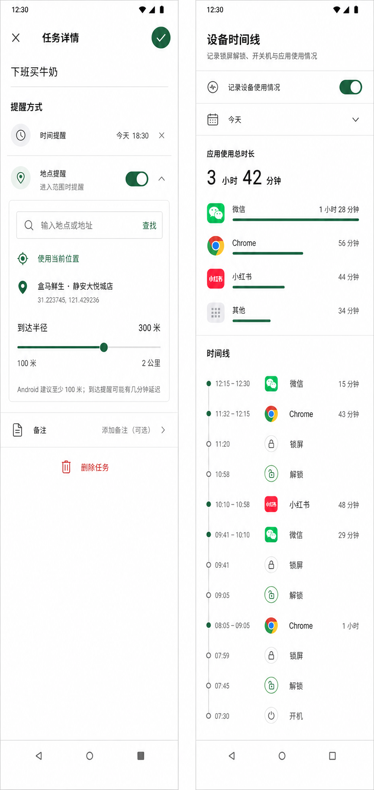

# Android 提醒与设备时间线设计方案

## 范围

- 只改变 Android 运行时界面与 Android 原生能力。
- Web 与 iOS 保持现状。
- 任务仍可同时设置时间提醒和地点提醒，两者互不覆盖，各自触发一次。

## 提醒逻辑

### 时间提醒

- 用户选择任务日期中的具体时间。
- Android 本地通知负责调度；应用退出后仍可触发。
- Android 12 及以上使用系统“闹钟和提醒”特殊权限保证按时触发。
- Android 13 及以上还需要通知权限。
- 修改时间或任务名称后取消旧通知并重新调度；清除时间、完成或删除任务后取消通知。

### 地点提醒

- 用户可手动输入地点/地址，使用 `expo-location` 的系统正向地理编码得到经纬度；也可使用当前位置。
- 用户每次从范围外进入以所选地点为圆心、指定半径的区域时触发本地通知；完成任务或关闭地点提醒后停止监控。
- 半径允许 100 米到 2 公里；默认 150 米。Android 官方建议实际围栏至少 100–150 米。
- 需要精确前台位置、后台“始终允许”位置和通知权限。只有用户主动开启地点提醒时才申请后台位置。
- Android 后台调度可能让到达通知延迟数分钟，界面明确说明这一限制。
- Android 每个应用最多同时监控 100 个围栏；同步时只注册待办且已开启地点提醒的任务，并限制到 100 个。

## Android 交互设计

- 在任务详情中新增独立的“提醒方式”区域，时间提醒和地点提醒始终可见，不再把地点提醒埋在普通“位置”字段里。
- 地点提醒展开后按顺序展示：地址输入、查找、使用当前位置、已选地点、到达半径滑杆、系统限制说明。
- 列表中的任务直接显示“到达 · 地点 · 半径”，让已开启的地点提醒无需进入详情也可识别。
- 视觉延续现有真白背景、深绿强调色、细分隔线和 Ionicons 图标，不引入图片资产或新导航。

## 设备时间线

- Android 原生服务使用官方 `UsageStatsManager / UsageEvents` 读取前台应用切换。
- 记录真实事件时间，并在应用持续前台时每分钟写入一次心跳；切换应用、锁屏或关机时关闭当前使用段。
- 页面按包名聚合同一天的应用段，展示总使用时长、每个应用总时长和占比条；下方保留逐段时间线。
- 小于一分钟的使用显示“不到 1 分钟”，避免有效记录被显示成 0 分钟。

## 设计系统

- 背景：`#FFFFFF`
- 强调色：`#2C5745`
- 主文字：`#161B18`
- 次文字：`#687168`
- 分隔线：`#D5DDD3`
- 圆角：8 / 10 / 12
- 触控目标：至少 44–48 dp
- 容器模型：开放列表与分隔线；仅地点编辑区使用单层浅边框容器

## 权威依据

- Android Geofencing：100 个活动围栏上限、建议 100–150 米最小半径  
  https://developer.android.com/develop/sensors-and-location/location/geofencing
- Android 后台位置权限流程  
  https://developer.android.com/develop/sensors-and-location/location/permissions/background
- Android 精确闹钟与“闹钟和提醒”权限  
  https://developer.android.com/develop/background-work/services/alarms
- Android `UsageEvents.Event` 前后台事件语义  
  https://developer.android.com/reference/android/app/usage/UsageEvents.Event
- Expo Location 的地址解析、后台权限和 Geofencing API  
  https://docs.expo.dev/versions/v56.0.0/sdk/location/
- Expo Notifications 的 Android 精确闹钟要求  
  https://docs.expo.dev/versions/v56.0.0/sdk/notifications/
- Apple Reminders 的地址输入、当前位置和可调围栏交互参考  
  https://support.apple.com/en-au/109064

## 视觉参考

